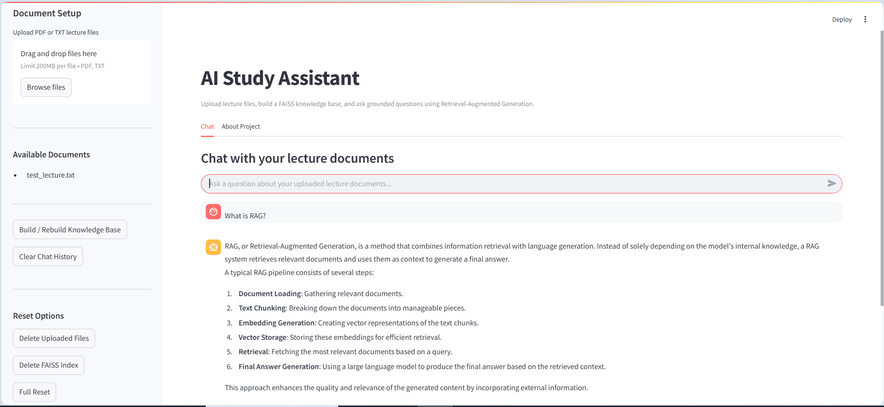

# AI Study Assistant

AI Study Assistant is a Retrieval-Augmented Generation (RAG) application designed to help students study lecture materials more effectively.

The system allows users to upload PDF or TXT lecture files, build a local FAISS-based knowledge base, and ask questions grounded in the uploaded documents. The assistant returns answers together with retrieved sources, making the responses easier to verify.

## Demo




## Project Goal

The goal of this project is to demonstrate a practical Generative AI system that combines:

- Document loading
- Text chunking
- Embedding generation
- Vector search
- Prompt engineering
- LLM-based answer generation
- Source-grounded responses
- Evaluation and testing
- A user-friendly Streamlit interface

This project was built as part of a Generative AI learning portfolio.

## Features

- Upload PDF and TXT lecture files
- Parse and load documents
- Split long documents into smaller chunks
- Generate embeddings using OpenAI or Gemini
- Store vectors locally with FAISS
- Ask questions through a RAG pipeline
- Display retrieved sources and previews
- Chat-style Streamlit interface
- Arabic and English question support
- RTL rendering support for Arabic text
- Chat history export as JSON
- Reset options for uploaded files and FAISS index
- Command-line interface
- Evaluation script for basic RAG quality checks
- Health check script for project readiness
- Unit tests with pytest
- Structured logging

## System Architecture

```text
User uploads PDF / TXT
        ↓
Document Loader
        ↓
Text Splitter
        ↓
Embedding Model
        ↓
FAISS Vector Store
        ↓
Retriever
        ↓
Prompt + LLM
        ↓
Answer + Sources
```

## Project Structure

```text
ai-study-assistant/
│
├── app/
│   ├── __init__.py
│   ├── config.py
│   ├── document_loader.py
│   ├── text_splitter.py
│   ├── vector_store.py
│   ├── rag_pipeline.py
│   ├── prompts.py
│   └── logger.py
│
├── data/
│   ├── raw/
│   │   └── .gitkeep
│   └── processed/
│       └── .gitkeep
│
├── reports/
│   └── evaluation_report.json
│
├── tests/
│   ├── test_document_loader.py
│   ├── test_text_splitter.py
│   ├── test_rag_pipeline.py
│   └── test_evaluation.py
│
├── vector_db/
├── logs/
├── run.py
├── streamlit_app.py
├── evaluate.py
├── health_check.py
├── requirements.txt
├── pytest.ini
├── .env.example
├── .gitignore
└── README.md
```

## Setup

### 1. Create a virtual environment

```bash
python -m venv .venv
```

### 2. Activate the environment

Windows PowerShell:

```bash
.venv\Scripts\activate
```

If activation is blocked, run:

```bash
Set-ExecutionPolicy -Scope Process -ExecutionPolicy RemoteSigned
.venv\Scripts\activate
```

### 3. Install dependencies

```bash
pip install -r requirements.txt
```

### 4. Configure environment variables

Create a `.env` file based on `.env.example`.

Example:

```env
OPENAI_API_KEY=your_openai_api_key_here
GOOGLE_API_KEY=your_google_api_key_here

PRIMARY_LLM_PROVIDER=openai
FALLBACK_LLM_PROVIDER=gemini

OPENAI_MODEL=gpt-4o-mini
GEMINI_MODEL=gemini-1.5-flash

EMBEDDING_PROVIDER=openai
OPENAI_EMBEDDING_MODEL=text-embedding-3-small
GEMINI_EMBEDDING_MODEL=models/text-embedding-004

CHUNK_SIZE=1000
CHUNK_OVERLAP=200

VECTOR_STORE_TYPE=faiss
TOP_K_RETRIEVAL=4

APP_NAME=AI Study Assistant
DEBUG=True
```

Important: never commit `.env` to GitHub.

## Usage

### Option 1: Run with Streamlit UI

```bash
streamlit run streamlit_app.py
```

Then:

1. Upload PDF or TXT lecture files from the sidebar.
2. Click `Build / Rebuild Knowledge Base`.
3. Ask a question in the chat.
4. Review the answer and retrieved sources.
5. Download the chat history if needed.

### Option 2: Run from the command line

Build the knowledge base:

```bash
python run.py build
```

Ask questions:

```bash
python run.py ask
```

### Option 3: Run the RAG pipeline directly

```bash
python -m app.rag_pipeline
```

## Example Questions

```text
What is Retrieval-Augmented Generation?
What are the main steps of a RAG pipeline?
Summarize the uploaded lecture.
اشرحلي RAG ببساطة.
ما هي خطوات نظام RAG؟
```

## Evaluation

Run the evaluation script:

```bash
python evaluate.py
```

The script checks whether the system:

- Returns answers for relevant document questions
- Returns sources
- Avoids answering unsupported questions from general knowledge
- Saves a structured report to `reports/evaluation_report.json`

Example output:

```text
Evaluation Summary
Passed: 3/3
Pass rate: 1.0
All evaluation cases passed.
```

## Health Check

Run:

```bash
python health_check.py
```

This checks whether:

- `.env` exists
- Settings are valid
- Required files exist
- `data/raw` exists
- Supported files are available
- FAISS index exists

## Tests

Run unit tests:

```bash
python -m pytest
```

Expected result:

```text
4 passed
```

## Logging

The project uses structured logging.

Logs are written to:

```text
logs/app.log
```

Log files are ignored by Git.

## Supported File Types

Currently supported:

```text
.pdf
.txt
```

Future extensions may include:

```text
.docx
.md
.pptx
```

## Quality and Safety Behavior

The assistant is instructed to answer using only the retrieved context from uploaded documents.

If the answer is not available in the provided documents, it should clearly say that it could not find the information.

The system also displays the retrieved sources used for each answer.

## Limitations

- The quality of answers depends on the uploaded documents.
- Large files may take longer to process.
- The current version is designed for a single-user local demo.
- FAISS storage is local and not shared across deployments.
- The project is educational and not production-ready yet.
- API usage may incur costs depending on the selected provider.

## Future Improvements

- Add Markdown and DOCX support
- Add persistent chat sessions
- Add user authentication
- Add advanced evaluation metrics
- Add reranking for better retrieval quality
- Add Docker support
- Add deployment instructions
- Add model/provider switching from the UI
- Add OCR support for scanned PDFs
- Add lecture summary and quiz generation modes

## Tech Stack

- Python
- Streamlit
- LangChain
- OpenAI / Gemini
- FAISS
- Pydantic
- PyPDF
- pytest

## License

This project is intended for educational and portfolio purposes.