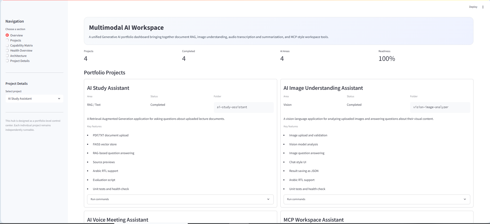
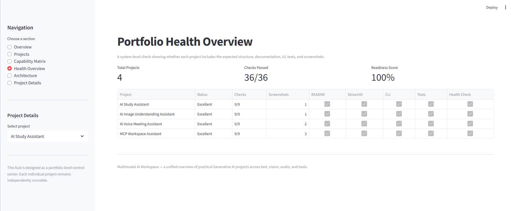
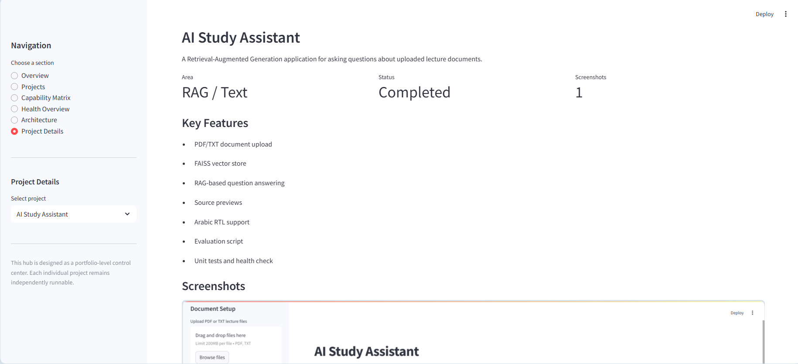

# Multimodal AI Workspace

Multimodal AI Workspace is a unified Generative AI portfolio dashboard that brings together multiple AI application areas in one professional Streamlit interface.

The project acts as a system-level hub for four independently built Generative AI projects:

- Retrieval-Augmented Generation / Text
- Vision-Language Understanding
- Voice / Audio Processing
- MCP-style Tool-Connected Workspace Assistant

Instead of merging all projects into one large and fragile codebase, this workspace provides a clean overview layer that presents capabilities, architecture, health status, screenshots, and local run instructions for each project.

## Project Goal

The goal of this project is to demonstrate portfolio-level system thinking.

This project shows how multiple Generative AI applications can be organized, documented, compared, and presented through one unified dashboard while keeping each project independently runnable and maintainable.

The dashboard highlights:

- Project overview
- Capability matrix
- Health overview
- Architecture overview
- Project details
- Demo screenshots
- Run commands
- Shared engineering practices

## Demo

### Portfolio Overview



### Portfolio Health Overview



### Project Details



## Why This Project Exists

The four individual projects demonstrate practical Generative AI implementation across different modalities.

This hub demonstrates a higher-level engineering perspective:

```text
Individual AI Applications
        ↓
Consistent Engineering Standards
        ↓
Unified Portfolio Dashboard
        ↓
System-Level Presentation
```

This makes the portfolio easier to review, easier to present, and easier to extend.

## Included Projects

| Project | Area | Status | Description |
|---|---|---|---|
| AI Study Assistant | RAG / Text | Completed | A Retrieval-Augmented Generation application for asking questions about uploaded lecture documents. |
| AI Image Understanding Assistant | Vision | Completed | A vision-language application for analyzing uploaded images and answering questions about their visual content. |
| AI Voice Meeting Assistant | Voice / Audio | Completed | A voice/audio application for transcribing audio files and generating structured summaries. |
| MCP Workspace Assistant | MCP / Tools | Completed | A tool-connected workspace assistant for safely interacting with local files through MCP-style tools. |

## Dashboard Sections

The Streamlit dashboard includes the following sections:

### Overview

Shows the complete portfolio at a glance, including:

- Number of projects
- Number of completed projects
- Number of covered AI areas
- Portfolio readiness score
- Project cards
- Shared engineering practices

### Projects

Displays all project cards with:

- Project name
- AI area
- Status
- Folder name
- Description
- Key features
- Local run commands

### Capability Matrix

Provides a compact comparison of the main capabilities across all projects.

### Health Overview

Checks whether each project includes important portfolio-quality elements:

- README
- Streamlit app
- CLI entry point
- Health check
- Tests
- Requirements file
- `.env.example`
- Screenshots

### Architecture

Shows the high-level architecture across the full Generative AI portfolio.

### Project Details

Displays detailed information and screenshots for each individual project.

## System Architecture

```text
Multimodal AI Workspace
│
├── Project Registry
│   └── Defines all portfolio projects and their metadata
│
├── Health Overview
│   └── Checks project structure, screenshots, tests, and documentation
│
├── UI Components
│   └── Reusable Streamlit rendering components
│
└── Streamlit Dashboard
    └── Unified portfolio interface
```

## Portfolio Architecture

```text
Generative AI Portfolio
│
├── RAG / Text
│   └── Document upload → Chunking → Embeddings → FAISS → LLM answer + sources
│
├── Vision
│   └── Image upload → Validation → Base64 encoding → Vision model → Answer + metadata
│
├── Voice / Audio
│   └── Audio upload → Transcription → Summarization → Structured result
│
└── MCP / Tools
    └── User command → Assistant router → Tools → Workspace manager → Safe file operations
```

## Project Structure

```text
multimodal-ai-workspace/
│
├── app/
│   ├── __init__.py
│   ├── config.py
│   ├── project_registry.py
│   ├── health_overview.py
│   ├── ui_components.py
│   ├── logger.py
│   └── utils.py
│
├── assets/
│   ├── screenshots/
│   │   └── .gitkeep
│   └── diagrams/
│       └── .gitkeep
│
├── data/
│   └── .gitkeep
│
├── outputs/
│   └── .gitkeep
│
├── logs/
│
├── tests/
│   ├── test_project_registry.py
│   └── test_health_overview.py
│
├── streamlit_app.py
├── health_check.py
├── requirements.txt
├── pytest.ini
├── .gitignore
└── README.md
```

## Setup

### 1. Create a virtual environment

```bash
python -m venv .venv
```

### 2. Activate the environment

Windows PowerShell:

```bash
.venv\Scripts\activate
```

If activation is blocked:

```bash
Set-ExecutionPolicy -Scope Process -ExecutionPolicy RemoteSigned
.venv\Scripts\activate
```

### 3. Install dependencies

```bash
pip install -r requirements.txt
```

## Usage

Run the dashboard:

```bash
python -m streamlit run streamlit_app.py
```

Then use the sidebar to navigate between:

- Overview
- Projects
- Capability Matrix
- Health Overview
- Architecture
- Project Details

## Health Check

Run:

```bash
python health_check.py
```

The script checks whether:

- The hub project structure is valid
- Required directories exist
- The project registry contains the four portfolio projects
- The portfolio health overview can be generated
- Registered projects have screenshots

## Tests

Run:

```bash
python -m pytest
```

Expected result:

```text
All tests passed
```

## Engineering Practices Demonstrated

Across the full portfolio, the projects follow consistent engineering practices:

- Modular Python structure
- Streamlit user interfaces
- Command-line entry points
- Environment-based configuration
- `.env.example` files
- `.gitignore` protection
- Structured logging
- Health checks
- Unit tests
- README documentation
- Demo screenshots
- Safe handling of generated and private files
- Separation of UI, pipeline logic, tools, and utility layers

## Design Decision

This project intentionally keeps the four main AI projects independent.

Instead of copying all functionality into one large app, the workspace acts as a clean orchestration and presentation layer.

This has several advantages:

- Lower complexity
- Easier debugging
- Independent project execution
- Clearer portfolio structure
- Better maintainability
- Easier future extension

## Future Improvements

- Add direct launch buttons for local projects
- Add automated subprocess-based health checks
- Add project dependency status checks
- Add combined demo mode
- Add integrated RAG, vision, audio, and MCP tabs
- Add Docker support
- Add deployment instructions
- Add generated architecture diagrams
- Add portfolio export as PDF
- Add CI workflow for tests

## Tech Stack

- Python
- Streamlit
- Pydantic
- pytest
- Git / GitHub

## License

This project is intended for educational and portfolio purposes.