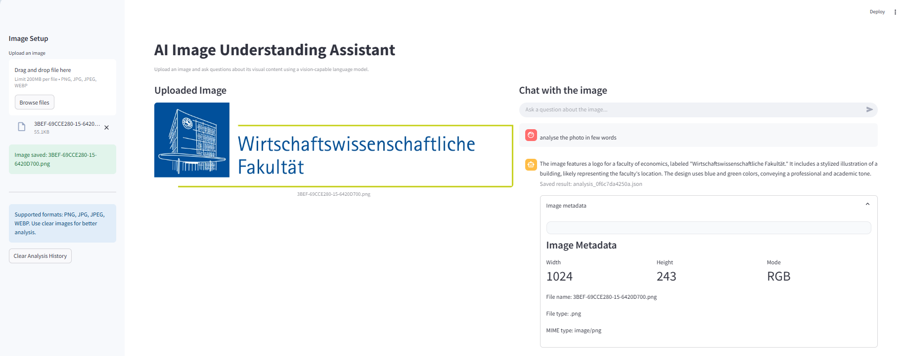

# AI Image Understanding Assistant

AI Image Understanding Assistant is a Generative AI vision project that allows users to upload images and ask questions about their visual content.

The application uses a vision-capable language model to analyze images, explain visible elements, summarize screenshots or slides, and answer user questions in a structured way.

## Demo



## Project Goal

The goal of this project is to demonstrate a practical Vision-Language AI application that combines:

- Image upload and validation
- Image metadata extraction
- Base64 image encoding
- Vision model prompting
- Image question answering
- Arabic, English, and German support
- Chat-style interaction
- Result saving as JSON
- Local logging
- Health checks
- Unit testing

This project is part of a larger Generative AI portfolio.

## Features

- Upload PNG, JPG, JPEG, and WEBP images
- Display uploaded images inside the Streamlit UI
- Ask custom questions about the image
- Analyze screenshots, slides, documents, diagrams, and general images
- Respond in Arabic, English, or German based on the user question
- Chat-style interface for multiple questions about the same image
- Arabic RTL rendering support
- Export analysis history as JSON
- Save each analysis result automatically inside `outputs/`
- Command-line interface for image analysis
- Structured logging
- Health check script
- Unit tests with pytest

## System Architecture

```text
User uploads image
        ↓
Image Loader
        ↓
Image validation
        ↓
Base64 encoding
        ↓
Vision Prompt
        ↓
Vision-Capable LLM
        ↓
Answer + Image Metadata
        ↓
Saved JSON Result
```

## Project Structure

```text
vision-image-analyzer/
│
├── app/
│   ├── __init__.py
│   ├── config.py
│   ├── image_loader.py
│   ├── logger.py
│   ├── prompts.py
│   ├── result_manager.py
│   ├── utils.py
│   └── vision_pipeline.py
│
├── data/
│   └── uploaded_images/
│       └── .gitkeep
│
├── outputs/
│   └── .gitkeep
│
├── logs/
│
├── tests/
│   ├── test_image_loader.py
│   ├── test_result_manager.py
│   └── test_text_direction.py
│
├── streamlit_app.py
├── run.py
├── health_check.py
├── requirements.txt
├── pytest.ini
├── .env.example
├── .gitignore
└── README.md
```

## Setup

### 1. Create a virtual environment

```bash
python -m venv .venv
```

### 2. Activate the environment

Windows PowerShell:

```bash
.venv\Scripts\activate
```

If activation is blocked:

```bash
Set-ExecutionPolicy -Scope Process -ExecutionPolicy RemoteSigned
.venv\Scripts\activate
```

### 3. Install dependencies

```bash
pip install -r requirements.txt
```

### 4. Configure environment variables

Create a `.env` file based on `.env.example`.

Example:

```env
OPENAI_API_KEY=your_openai_api_key_here
GOOGLE_API_KEY=your_google_api_key_here

VISION_PROVIDER=openai

OPENAI_VISION_MODEL=gpt-4o-mini
GEMINI_VISION_MODEL=gemini-1.5-flash

APP_NAME=AI Image Understanding Assistant
DEBUG=True
```

Important: never commit `.env` to GitHub.

## Usage

### Option 1: Run the Streamlit app

```bash
python -m streamlit run streamlit_app.py
```

Then:

1. Upload an image from the sidebar.
2. Ask a question about the image.
3. Review the answer and image metadata.
4. Ask follow-up questions about the same image.
5. Download the analysis history if needed.

### Option 2: Run from the command line

Analyze an image:

```bash
python run.py analyze data\uploaded_images\test_image.png
```

Analyze with a custom question:

```bash
python run.py analyze data\uploaded_images\test_image.png --question "Explain this image in detail"
```

Arabic example:

```bash
python run.py analyze data\uploaded_images\test_image.png --question "اشرحلي الصورة دي بالتفصيل"
```

## Example Questions

```text
Analyze this image carefully.
What are the main objects in this image?
Summarize this screenshot.
Explain this slide.
What text is visible in the image?
اشرحلي الصورة دي بالتفصيل.
ما أهم العناصر الموجودة في الصورة؟
```

## Health Check

Run:

```bash
python health_check.py
```

The script checks whether:

- `.env` exists
- Settings are valid
- Important project files exist
- Required directories exist
- Uploaded images are available
- Analysis output files exist

## Tests

Run unit tests:

```bash
python -m pytest
```

Expected result:

```text
6 passed
```

## Logging

The project writes logs to:

```text
logs/app.log
```

Log files are ignored by Git.

## Saved Results

Each image analysis is saved automatically as a JSON file inside:

```text
outputs/
```

Example result structure:

```json
{
  "result_id": "...",
  "created_at": "...",
  "image_path": "...",
  "question": "...",
  "answer": "...",
  "image_metadata": {
    "file_name": "...",
    "width": 100,
    "height": 50,
    "mime_type": "image/png"
  }
}
```

Generated output files are ignored by Git.

## Supported Image Types

```text
.png
.jpg
.jpeg
.webp
```

## Quality and Safety Behavior

The assistant is instructed to answer based only on what is visible in the image.

If something is unclear, unreadable, or not visible, the assistant should say that clearly instead of inventing details.

## Limitations

- The quality of analysis depends on image clarity.
- Very small or blurry text may not be read accurately.
- The project currently uses OpenAI vision models by default.
- Gemini support is planned but may not be fully implemented in the current pipeline.
- The application is designed as a local single-user demo.
- API usage may incur costs depending on the provider.

## Future Improvements

- Add Gemini Vision support
- Add OCR preprocessing for scanned documents
- Add automatic image resizing and compression
- Add batch image analysis
- Add image comparison mode
- Add persistent analysis sessions
- Add Docker support
- Add deployment instructions
- Add demo screenshots
- Add evaluation cases for image analysis quality

## Tech Stack

- Python
- Streamlit
- OpenAI Vision
- Pillow
- Pydantic
- pytest

## License

This project is intended for educational and portfolio purposes.